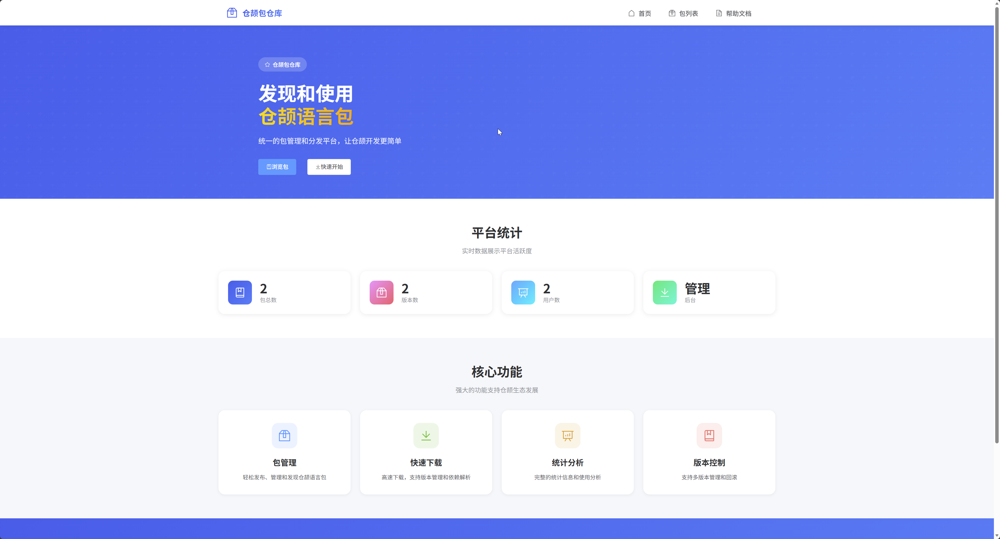
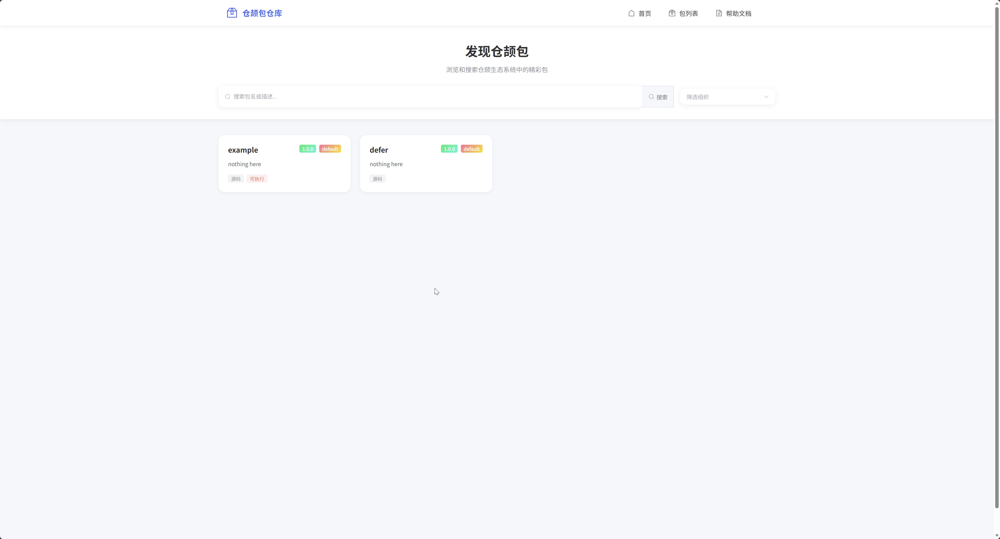
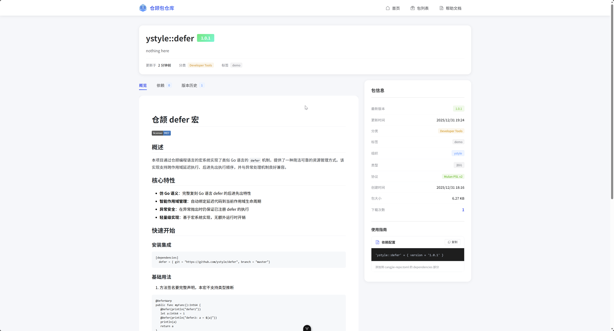
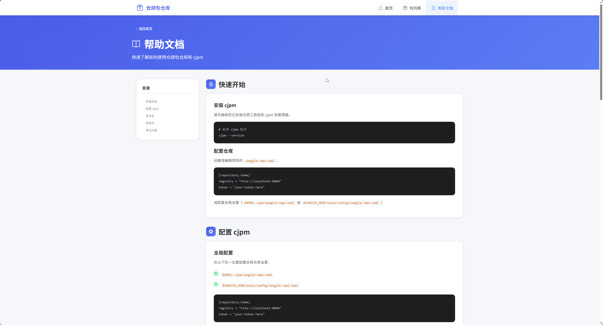
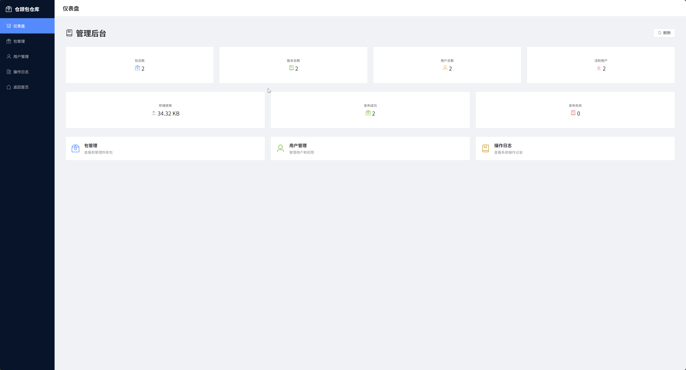
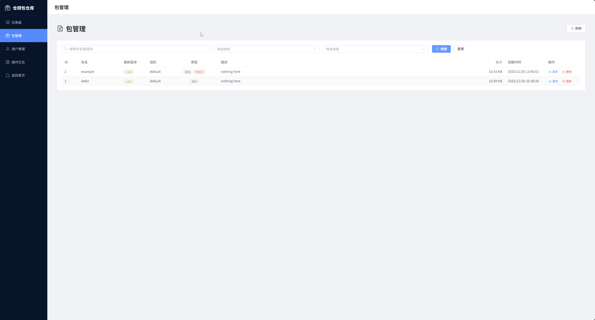
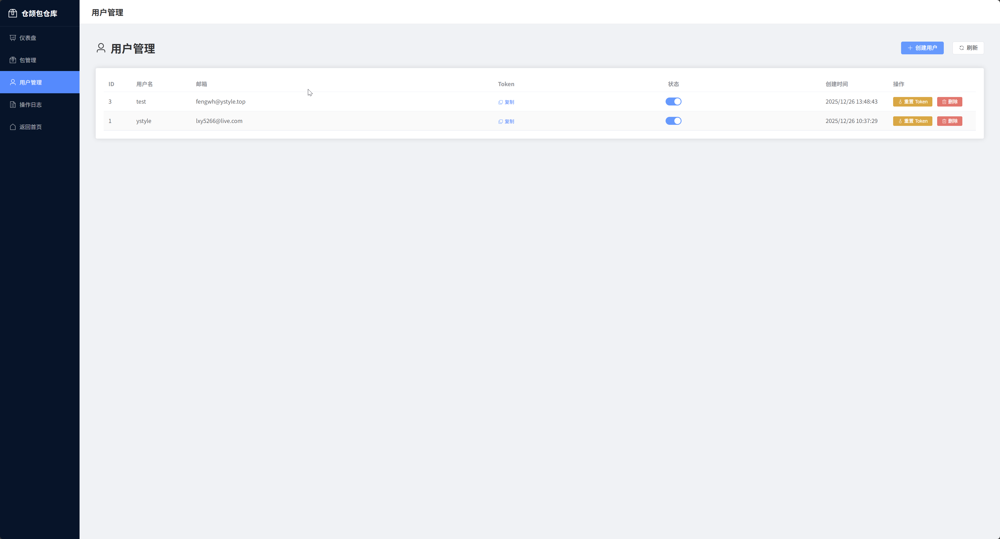
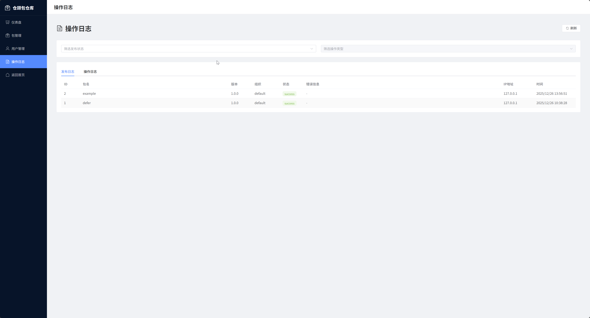
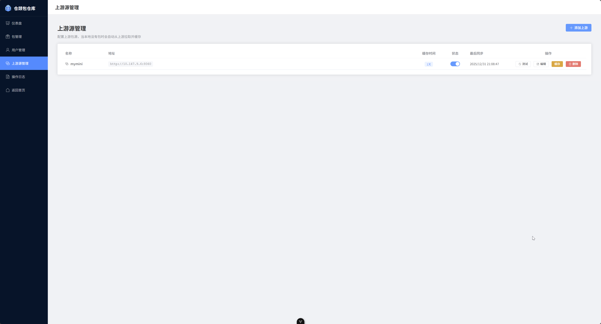

# CJRepo - 仓颉中央库服务

一个兼容 `cjpm` 的仓颉包中央库服务，支持包的发布、下载和索引查询。

## 特性

- 📦 **包管理** - 完整的包发布、下载、索引查询功能
- 🏢 **组织管理** - 支持多组织隔离，控制用户上传权限
- 🌐 **上游源代理** - 支持配置上游中央库，自动代理和缓存包，可清理缓存释放空间
- 🎨 **Web 管理界面** - Vue 3 构建的现代化管理后台
- 📊 **数据统计** - 实时展示包数量、用户数、存储使用情况
- 🔐 **安全的认证** - JWT token 认证，30分钟有效期
- 📝 **操作日志** - 完整的发布日志和管理员操作记录
- 🔍 **强大的搜索** - 支持包名、描述、组织、类型筛选
- 🐳 **Docker 支持** - 开箱即用的 Docker 部署方案
- 📱 **响应式设计** - 完美适配桌面和移动设备

## 系统要求

### 仓颉 SDK 版本要求

**重要提示**：使用包发布和依赖管理功能需要仓颉 SDK **Nightly Build 1.1.0-alpha.20251226020001** 或更高版本。

- ✅ **cjpm publish** - 发布包到仓库
- ✅ **cjpm install** - 安装和管理依赖
- ✅ **cjpm update** - 更新包索引

低于此版本的 SDK 可能不支持部分功能或存在兼容性问题。

**下载地址**：
- [仓颉 Nightly Build 发布页](https://gitcode.com/Cangjie/nightly_build/releases) - 1.1.0 正式发布前的版本下载
- [仓颉编程语言官网](https://docs.cangjie-lang.cn/) - 官方文档和指南

### 环境要求

**使用 Docker Compose（推荐）**：
- Docker 20.10+
- Docker Compose 2.0+

**手动安装**：
- Go 1.23+
- Node.js 18+ 和 pnpm（用于构建前端）
- SQLite 3（自动包含）

## 快速开始

### 一键启动（推荐）

使用 Docker Compose 一键启动，无需手动安装依赖：

```bash
# 1. 克隆项目
git clone https://gitcode.com/ystyle/cjrepo
cd cjrepo

# 2. 修改管理员密钥（重要！）
# 编辑 docker-compose.yml，修改 CJREPO_ADMIN_KEY 为强密码
vim docker-compose.yml

# 3. 一键启动
docker-compose up -d

# 4. 查看日志
docker-compose logs -f cjrepo

# 5. 访问服务
# 浏览器打开 http://localhost:8060
# 管理后台：http://localhost:8060/admin
```

服务将在后台运行，数据会持久化到 `./data` 和 `./storage` 目录。

### 停止服务

```bash
# 停止服务
docker-compose down

# 停止并删除数据（谨慎使用）
docker-compose down -v
```

### 添加用户

```bash
# 在容器中创建新用户
docker-compose exec cjrepo ./cjrepo user add alice alice@example.com

# 输出示例：
# ✓ User created successfully!
# Token: token-alice-12345
#
# Add this to your cangjie-repo.toml:
# [repository.home]
# registry = "http://localhost:8060"
# token = "token-alice-12345"
```

### 配置 cjpm

创建或编辑项目的 `cangjie-repo.toml`：

```toml
[repository.home]
registry = "http://localhost:8060"
token = "token-alice-12345"
```

或配置全局设置（`$HOME/.cjpm/cangjie-repo.toml` 或 `$CANGJIE_HOME/tools/config/cangjie-repo.toml`）。

### 手动安装（可选）

如果你想手动编译和运行：

```bash
# 1. 安装依赖
# Go 1.23+
# Node.js 18+ 和 pnpm（用于构建前端）

# 2. 克隆项目
git clone https://gitcode.com/ystyle/cjrepo
cd cjrepo

# 3. 构建前端
cd frontend
pnpm install
pnpm build
cd ..

# 4. 构建后端
go build -o cjrepo main.go

# 5. 设置环境变量（必需）
export CJREPO_ADMIN_KEY=your-secret-admin-key

# 可选：设置站点名称
export CJREPO_SITE_NAME=仓颉包仓库

# 6. 启动服务
./cjrepo
```


## 功能概览

### 界面预览

#### 首页


公开首页展示站点统计信息、最新发布的包和快速导航。

#### 包列表


浏览和搜索所有已发布的仓颉包，支持按名称、描述和组织筛选。

#### 包详情


查看包的详细信息、所有版本、依赖关系和安装命令。

#### 帮助文档


完整的配置教程和 cjpm 使用说明。

#### 管理后台 Dashboard


Dashboard 实时展示包数量、用户数、存储使用情况和发布统计。

#### 包管理


管理所有包（查看、删除、恢复），支持搜索和类型筛选。

#### 用户管理


创建用户、启用/禁用账户、重置 Token。

#### 操作日志


查看发布日志和管理员操作记录。

#### 上游源管理


配置上游中央库，支持自动代理和缓存。当本地没有包时会自动从上游拉取，可查看缓存统计并清理过期缓存释放空间。

### 公开页面（无需登录）

- **首页** (`/`)
  - 站点统计信息
  - 最新发布的包
  - 快速导航

- **包搜索** (`/packages`)
  - 搜索包（按名称、描述）
  - 按组织筛选
  - 查看包详情和版本信息

- **帮助文档** (`/docs`)
  - 配置 cangjie-repo.toml 教程
  - 配置 cjpm.toml 教程
  - cjpm 命令使用说明
  - 常见问题解答

### 管理后台（需要登录）

访问 `/admin` 进入管理后台，使用管理员密钥登录。

#### Dashboard (`/admin/dashboard`)
- 包总数、版本总数
- 用户数量、活跃用户数
- 存储使用情况
- 发布成功/失败统计

#### 包管理 (`/admin/packages`)
- 包列表（支持搜索、分页）
- 按组织、类型筛选（源码/二进制/可执行）
- 查看包的所有版本
- 软删除包（可恢复）
- 硬删除包（永久删除）

#### 用户管理 (`/admin/users`)
- 用户列表
- 创建新用户
- 启用/禁用用户
- 重置用户 Token
- 删除用户

#### 操作日志 (`/admin/logs`)
- 发布日志（成功/失败）
- 管理员操作日志
- 按状态、操作类型筛选

#### 上游源管理 (`/admin/upstreams`)
- 配置上游中央库（默认：`https://pkg.cangjie-lang.cn/cjpm`）
- 启用/禁用上游源
- 测试上游连接
- 查看缓存统计（包数量、占用空间、包列表）
- 清理上游缓存（释放磁盘空间）
- 自动代理模式：当本地没有包时自动从上游拉取并缓存

**使用场景**：
- 私有仓库：配置上游中央库，本地私有包和公共包统一管理
- 缓存优化：长期使用后清理不再使用的旧版本包，释放存储空间
- 离线加速：缓存常用包后，即使上游不可用也能继续使用

#### 组织管理 (`/admin/organizations`)
- 创建/编辑/删除组织（软删除）
- 设置默认组织
- 添加/移除组织成员
- 查看组织统计（成员数、包数）
- 上传权限控制：只有组织成员可以上传到该组织
- 超级管理员可以上传到任何组织

**权限规则**：
- 超级管理员：可以上传到任何组织，不受限制
- 普通用户：只能上传到自己所属的组织
- 下载和索引：公开，无需权限

**使用场景**：
- 企业多团队：不同团队使用不同组织，包互相隔离
- 权限控制：只有团队成员可以上传到团队组织
- 默认组织：企业统一使用默认组织，简化配置

## 部署指南

### 生产环境

#### 使用 Docker Compose（推荐）

**1. 修改配置**

编辑 `docker-compose.yml`，修改以下环境变量：

```yaml
environment:
  # 修改管理员密钥为强密码（必需）
  - CJREPO_ADMIN_KEY=your-very-secure-admin-key-here
  # 修改站点名称（可选）
  - CJREPO_SITE_NAME=仓颉包仓库
```

**2. 启动服务**

```bash
# 构建并启动
docker-compose up -d

# 查看日志
docker-compose logs -f cjrepo

# 停止服务
docker-compose down

# 重启服务
docker-compose restart cjrepo
```

**3. 数据持久化**

数据会自动持久化到以下目录：
- `./data` - SQLite 数据库文件
- `./storage` - 包文件存储

**4. 备份和恢复**

```bash
# 备份数据
tar -czf cjrepo-backup-$(date +%Y%m%d).tar.gz data/ storage/

# 恢复数据
tar -xzf cjrepo-backup-20240101.tar.gz
```

#### 使用 Docker 命令

如果不想使用 Docker Compose，可以直接使用 Docker 命令：

```bash
# 1. 构建镜像
docker build -t cjrepo:latest .

# 2. 运行容器
docker run -d \
  --name cjrepo \
  -p 8060:8060 \
  -e CJREPO_ADMIN_KEY=your-very-secure-admin-key-here \
  -e CJREPO_SITE_NAME=仓颉包仓库 \
  -v $(pwd)/data:/app/data \
  -v $(pwd)/storage:/app/storage \
  --restart unless-stopped \
  cjrepo:latest

# 3. 查看日志
docker logs -f cjrepo

# 4. 执行用户管理
docker exec -it cjrepo ./cjrepo user add alice alice@example.com

# 5. 停止并删除容器
docker stop cjrepo
docker rm cjrepo
```

#### 使用 systemd

创建 `/etc/systemd/system/cjrepo.service`：

```ini
[Unit]
Description=Cangjie Package Repository
After=network.target

[Service]
Type=simple
User=cjrepo
WorkingDirectory=/opt/cjrepo
Environment="CJREPO_ADMIN_KEY=your-admin-key"
Environment="CJREPO_SITE_NAME=仓颉包仓库"
ExecStart=/opt/cjrepo/cjrepo
Restart=always
RestartSec=5

[Install]
WantedBy=multi-user.target
```

启动服务：
```bash
sudo systemctl daemon-reload
sudo systemctl enable cjrepo
sudo systemctl start cjrepo
```

#### 使用 Nginx 反向代理

创建 `/etc/nginx/sites-available/cjrepo`：

```nginx
server {
    listen 80;
    server_name repo.example.com;

    location / {
        proxy_pass http://localhost:8060;
        proxy_set_header Host $host;
        proxy_set_header X-Real-IP $remote_addr;
        proxy_set_header X-Forwarded-For $proxy_add_x_forwarded_for;
        proxy_set_header X-Forwarded-Proto $scheme;

        # 上传大小限制
        client_max_body_size 500M;
    }
}
```

## 环境变量

| 变量名 | 必需 | 默认值 | 说明 |
|--------|------|--------|------|
| `CJREPO_ADMIN_KEY` | ✅ | - | 管理员密钥，用于管理后台登录 |
| `CJREPO_SITE_NAME` | ❌ | "仓颉包仓库" | 站点名称 |
| `CJREPO_REQUIRE_AUTH` | ❌ | `false` | 是否开启强制认证：开启后，包下载和索引查询也需要 token 认证（默认仅发布需要认证） |
| `CJREPO_DEFAULT_ORGANIZATION` | ❌ | - | 默认组织名称：启动时自动创建，用于企业私有仓库场景 |

## 命令参考

### Docker Compose 命令

```bash
# 启动服务
docker-compose up -d

# 查看日志
docker-compose logs -f cjrepo

# 停止服务
docker-compose down

# 重启服务
docker-compose restart cjrepo

# 用户管理
docker-compose exec cjrepo ./cjrepo user add <username> <email>
docker-compose exec cjrepo ./cjrepo user list
docker-compose exec cjrepo ./cjrepo user delete <username>
```

### 服务命令（手动安装）

```bash
./cjrepo                    # 启动服务器
./cjrepo help              # 显示帮助
./cjrepo version           # 显示版本
```

### 用户管理（手动安装）

```bash
./cjrepo user add <username> <email>     # 创建用户
./cjrepo user list                       # 列出所有用户
./cjrepo user delete <username>          # 删除用户
```

### cjpm 命令

```bash
cjpm init --name <name>        # 初始化项目
cjpm check                     # 检查并下载依赖
cjpm update                    # 更新索引
cjpm bundle                    # 打包
cjpm publish                   # 发布包
cjpm build                     # 编译
cjpm run                       # 运行
```

## 常见问题

### 1. 如何登录管理后台？

访问 `http://localhost:8060/admin`，使用 `docker-compose.yml` 中配置的 `CJREPO_ADMIN_KEY` 密钥登录。

### 2. 忘记管理员密钥怎么办？

查看 `docker-compose.yml` 文件中的 `CJREPO_ADMIN_KEY` 环境变量，或修改为新密钥后重启：

```bash
# 编辑配置
vim docker-compose.yml

# 重启服务
docker-compose restart cjrepo
```

### 3. Token 有效期是多久？

JWT token 有效期为 30 分钟，过期后需要重新登录。

### 4. 发布失败：401 Unauthorized

**原因**：Token 无效或未配置

**解决**：
```bash
# 使用 Docker Compose
docker-compose exec cjrepo ./cjrepo user list

# 或手动安装
./cjrepo user list

# 更新 cangjie-repo.toml 中的 token
```

### 5. 下载失败：404 Not Found

**原因**：包不存在或版本不匹配

**解决**：
```bash
# 更新索引
cjpm update <pkgname>

# 检查可用版本
```

### 6. Docker 容器无法启动

```bash
# 查看日志
docker-compose logs cjrepo

# 检查端口是否被占用
lsof -i :8060

# 重新构建
docker-compose down
docker-compose build
docker-compose up -d
```

### 7. SDK 版本要求

**Q: 最低需要什么版本的仓颉 SDK？**

**A**: 需要 **Nightly Build 1.1.0-alpha.20251226020001** 或更高版本。

低于此版本的 SDK 可能不支持以下功能：
- `cjpm publish` - 发布包到仓库
- `cjpm install` - 安装和管理依赖
- `cjpm update` - 更新包索引

**下载地址**：
- [仓颉 Nightly Build 发布页](https://gitcode.com/Cangjie/nightly_build/releases) - 1.1.0 正式发布前的版本
- [仓颉编程语言官网](https://docs.cangjie-lang.cn/) - 官方文档

### 8. 依赖缓存位置

依赖下载在 `~/.cjpm/repository/`：
- `index/` - 索引文件
- `source/` - 源码包

如需重新下载，删除对应的目录即可：
```bash
rm -rf ~/.cjpm/repository/source/{org}/{name}-{version}
cjpm check
```

### 9. 强制认证（私有仓库模式）

**Q: 如何让下载和索引也需要认证？**

**A**: 设置环境变量 `CJREPO_REQUIRE_AUTH=true` 开启强制认证模式：

**使用 Docker Compose**：
```yaml
environment:
  - CJREPO_ADMIN_KEY=your-admin-key
  - CJREPO_REQUIRE_AUTH=true  # 开启强制认证
```

**手动安装**：
```bash
export CJREPO_REQUIRE_AUTH=true
./cjrepo
```

**开启后**：
- ✅ 包发布需要 token（始终需要）
- ✅ 包下载需要 token（开启后需要）
- ✅ 索引查询需要 token（开启后需要）

**使用场景**：
- 私有企业仓库：所有操作都需要认证
- 防止未授权访问：保护包和索引不被公开访问
- 配合上游代理：为私有包提供统一入口

**上游配置**：如果上游仓库也开启了认证，在上游管理中配置 `auth_token` 即可。

### 10. 组织权限控制

**Q: 发布包时提示 "没有权限上传到该组织"，怎么办？**

**A**: 这是因为该用户不属于目标组织。解决方法：

1. **添加用户到组织**：
   - 管理员登录 → 组织管理 → 点击"成员"按钮
   - 输入用户名添加成员
   - 用户即可上传到该组织

2. **设置为超级管理员**：
   ```sql
   UPDATE users SET is_superuser = 1 WHERE username = 'youruser';
   ```
   - 超级管理员可以上传到任何组织

3. **创建新组织**：
   - 如果组织不存在，第一个上传到该组织的用户会自动创建它
   - 但建议管理员先创建组织并添加成员

**Q: 如何设置超级管理员？**

**A**: 通过数据库直接设置：
```bash
sqlite3 data/cjrepo.db "UPDATE users SET is_superuser = 1 WHERE username = 'admin';"
```

**Q: 默认组织有什么作用？**

**A**:
- 通过 `CJREPO_DEFAULT_ORGANIZATION` 环境变量指定
- 服务启动时自动创建（如果不存在）
- 企业场景建议配置，统一使用默认组织

## 数据库管理

```bash
# 查看已发布的包
sqlite3 data/cjrepo.db "SELECT organization, name, version, description FROM packages WHERE deleted_at IS NULL;"

# 查看用户
sqlite3 data/cjrepo.db "SELECT username, email, token, is_active FROM users;"

# 查看发布日志
sqlite3 data/cjrepo.db "SELECT * FROM publish_logs ORDER BY created_at DESC LIMIT 10;"

# 查看管理员操作日志
sqlite3 data/cjrepo.db "SELECT * FROM admin_log ORDER BY created_at DESC LIMIT 10;"
```

## 项目结构

```
cjrepo/
├── main.go              # 主入口（包含路由和用户管理）
├── internal/            # 内部实现
│   ├── handlers/        # HTTP 处理器
│   │   ├── admin.go     # 管理后台 API
│   │   ├── public.go    # 公开 API
│   │   ├── publish.go   # 发布端点
│   │   ├── download.go  # 下载端点
│   │   └── index.go     # 索引端点
│   ├── middleware/      # 中间件
│   │   └── auth.go      # JWT 认证中间件
│   ├── models/          # 数据模型
│   │   ├── package.go   # Package, User, PublishLog
│   │   └── admin_log.go # AdminLog
│   ├── protocol/        # 协议解析
│   │   └── parser.go    # 二进制协议解析器
│   ├── storage/         # 文件存储管理
│   │   └── manager.go   # 存储路径管理
│   └── auth/            # 认证服务
│       └── auth.go      # JWT 生成和验证
├── frontend/            # Vue 3 前端
│   ├── src/
│   │   ├── views/       # 页面组件
│   │   ├── components/  # 通用组件
│   │   ├── api/         # API 封装
│   │   ├── layouts/     # 布局组件
│   │   └── stores/      # 状态管理
│   ├── package.json
│   └── vite.config.ts
├── data/                # 数据库文件
├── storage/             # 包文件存储
├── Dockerfile           # Docker 镜像构建
├── docker-compose.yml   # Docker Compose 配置
└── .dockerignore        # Docker 忽略文件
```

## 技术栈

### 后端
- **Go 1.23** - 核心语言
- **Fiber** - Web 框架
- **XORM** - ORM 框架
- **SQLite** - 数据库
- **JWT** - 认证
- **Go Embed** - 静态资源嵌入

### 前端
- **Vue 3** - 前端框架
- **Element Plus** - UI 组件库
- **Vite** - 构建工具
- **TypeScript** - 类型支持
- **Vue Router** - 路由管理
- **Axios** - HTTP 客户端
- **CryptoJS** - MD5 加密

## 许可证

MIT License

## 相关资源

- **[PROTOCOL.md](PROTOCOL.md)** - 详细的协议规范、API 接口和架构设计文档
- [仓颉编程语言官方文档](https://docs.cangjie-lang.cn/)
- [cjpm 使用指南](https://cangjie-lang.cn/docs?url=%2F1.0.4%2Ftools%2Fsource_zh_cn%2Ftools%2Fcjpm_manual_cjnative_community.html)
